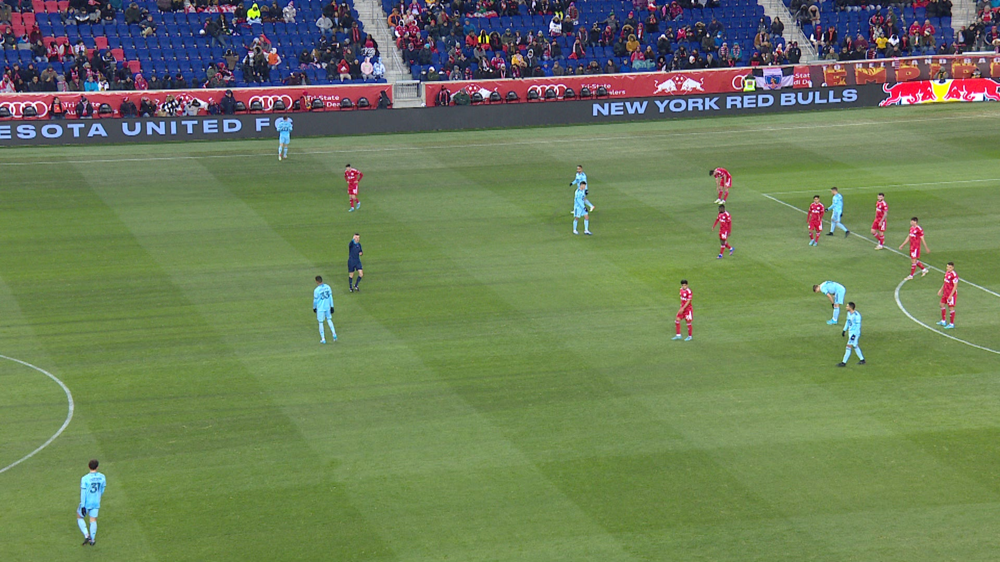
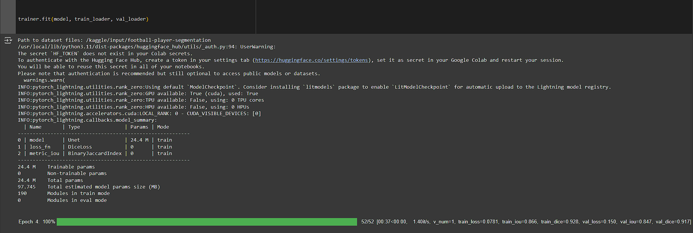
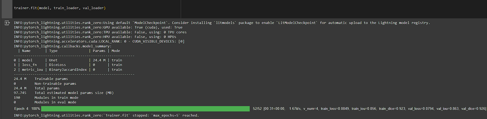
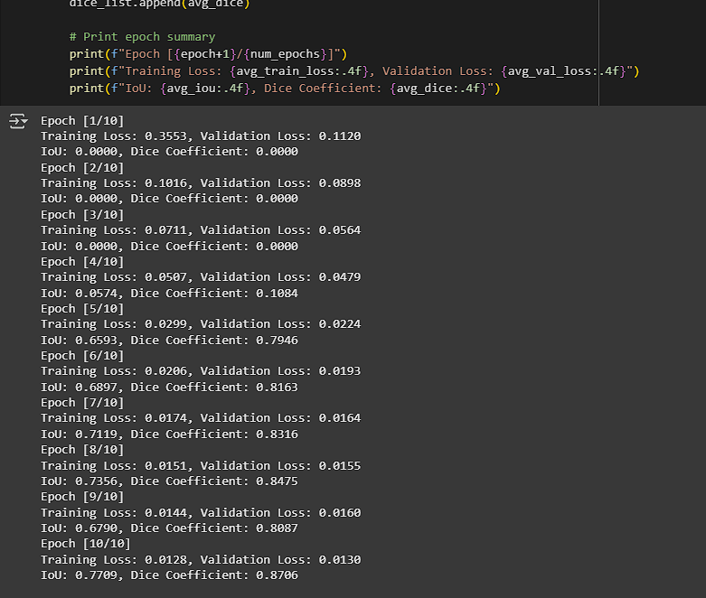

# Лабораторные работы # 7, 8

| Студент   | Медведев Кирилл Викторович   |
|:-----------:|:-----------:|
| Группа    | М8О-406Б-21    |

# Датасет

**Ссылка:** [Football Player Segmentation dataset](https://www.kaggle.com/discussions/getting-started/401717)

**Цель:** Автоматическая идентификация и разделение объектов (Игроков и судей) на футбольных изображениях. Это может использоваться в спортивной аналитике, судействе, трекинге и телетрансляциях.

**Пример исходного изображения и разметки:**

# Семантическая сегментация

| Модель   | IoU | Dice |
|:-----------:|:-----------:|:------:|
| Бэйзлайн  |  0.847   | 0.917 |
| Улучшенный бэйзлайн  |  0.863   | 0.926 |
| Самостоятельная реализация | 0.7709 | 0.8706 |

При отображении результатов работы ячеек, использующих библиотку `pytorch` в GitHub возникли проблемы, поэтому вывод ячеек был очищен, а результаты работы приведены ниже.

## **Бэйзлайн**

## **Улучшенный бэйзлайн**

## **Самостоятельная реализация**

## Выводы

# Обнаружение и распознавание объектов