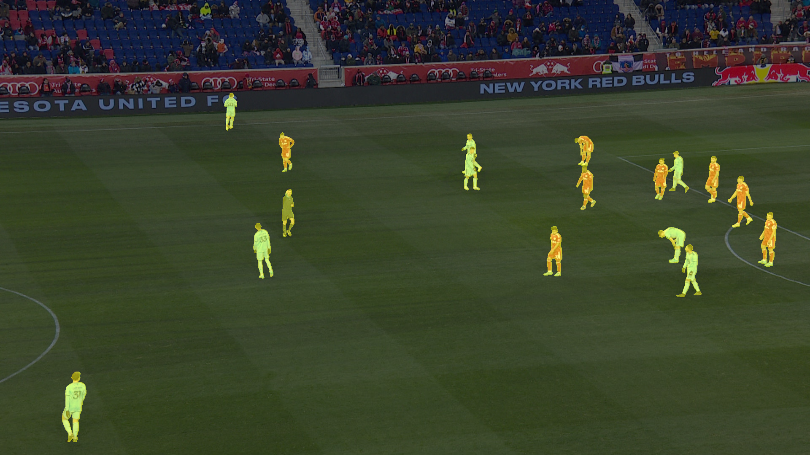

# Лабораторные работы # 7, 8

| Студент   | Медведев Кирилл Викторович   |
|:-----------:|:-----------:|
| Группа    | М8О-406Б-21    |

# Датасет

**Ссылка:** https://www.kaggle.com/datasets/sadhliroomyprime/football-semantic-segmentation
**Цель:** Автоматическая идентификация и разделение объектов (таких как игроки, мяч, поле и другие элементы сцены) на футбольных изображениях. Это может использоваться в спортивной аналитике, судействе, трекинге и телетрансляциях.
**Пример исходного изображения и разметки:**

